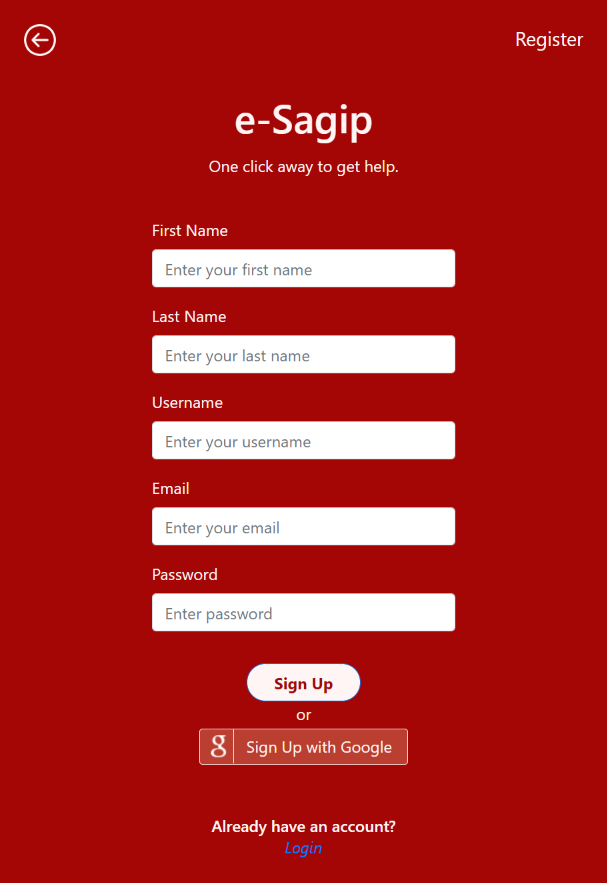
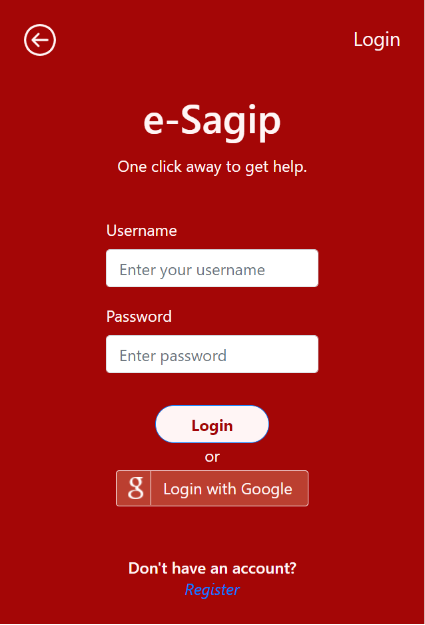
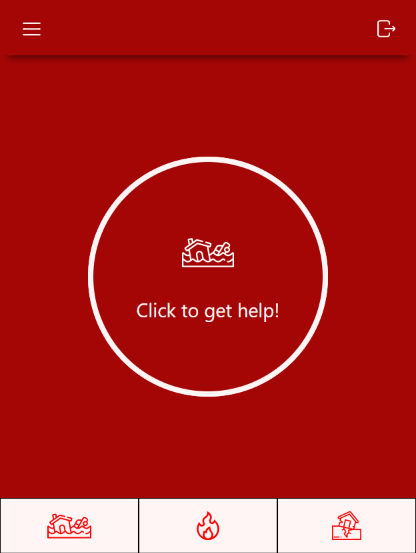
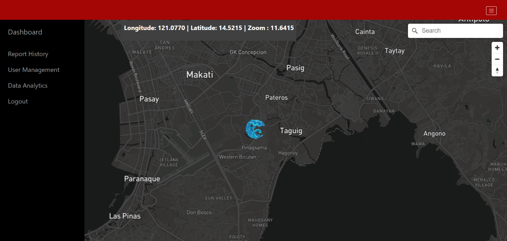

## Links
User demo: https://www.youtube.com/watch?v=cGYt7ip70Fc   
Front-end Repo: https://github.com/chingu-voyages/vk1-bears-team-02    
Back-end Repo: https://github.com/chingu-voyages/vk1-bears-team-02BE    

## Table of Contents

<a href="#intro">1. Introduction</a> <br>
<a href="#userGuide">2. User Guide</a> <br>
<a href="#tech">3. Technology Used</a>    
<a href="#team">4. Meet the Team</a> <br>
<a href="#build">5. Build Setup</a>    
<a href="#env">6. Environment Variables </a>

## <h2 id="intro">Introduction</h2>

E-Sagip is a real-time, disaster emergency response application that aims to enable faster, and more efficient calamity reporting and government aid.

## <h2 id="userGuide"> User Guide </h2>

1. Create your account.       
       

2. Login your account.    
   

3. Choose the type of disaster that is currently happening in your area. Then, click the button to send a distress alert.     
   

4. Wait for the first responders to arrive in your area.

Here's what the admin side sees when you send a distress alert.



## <h2 id="tech"> Technology Used </h2>
 A series of open-source resources were used to make this project possible.
* [ReactJS]
* [node.js]
* [Mapbox]
* [Pusher]
* [PassportJS]
* [MongoDB Atlas]

## <h2 id="team">Meet the Team </h2>
- [John Cunanan](https://github.com/theCodingJohn)
- [Ivan Christian Jay Funcion](https://github.com/supremeking23)
- [Christian Tan](https://github.com/mikotan-cpu)

## <h2 id="build">Build Setup</h2>

```bash
# Install dependencies
$ yarn install

# Runs the app in the development mode.
$ yarn start

# Launches the test runner in the interactive watch mode.
$ yarn test

# Builds the app for production to the build folder.
$ yarn build
```
## <h2 id="env"> Environment Variables </h2>
 This application uses the following environment variables:
 - REACT_APP_PUSHER_ID
 - REACT_APP_CLUSTER
 - REACT_APP_MAPBOX_ACCESS_TOKEN
 - REACT_APP_BACKEND=http://localhost:5000/
 - REACT_APP_FRONTEND=http://localhost:3000/

